# ASCII Screensaver Ecosystem

*Last updated: September 20, 2026*

Welcome to the **ASCII Screensaver** for [Omarchy](https://omarchy.org).

We are launching a brand-new community **Marketplace** for ASCII animations, and we need your help to build it out! What started as a simple plugin is evolving into an open ecosystem where anyone can build, share, and install screensavers directly from inside Omarchy. 

Whether you're a seasoned developer or just want to prompt an AI to build something cool for you, this guide has everything you need to create your own screensaver and help us populate the new Marketplace.

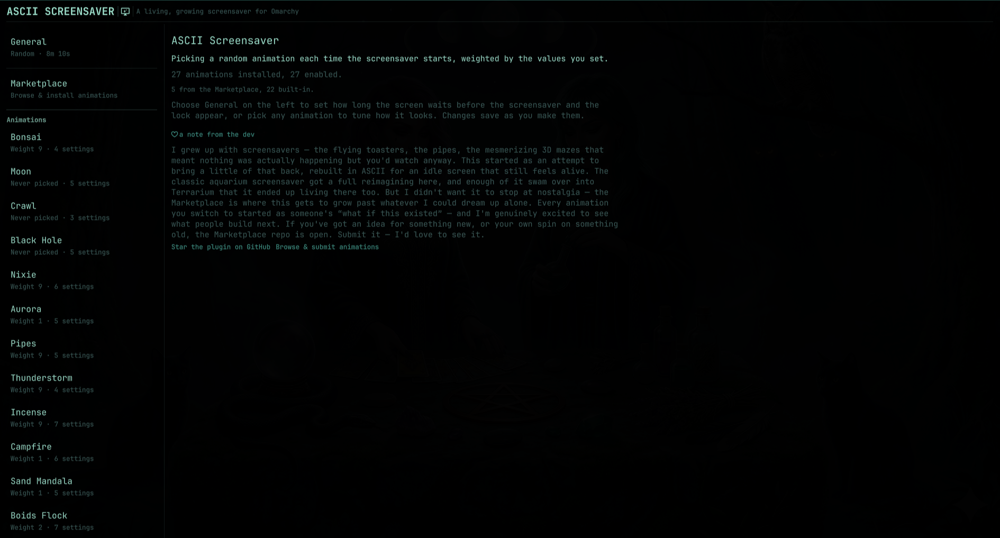
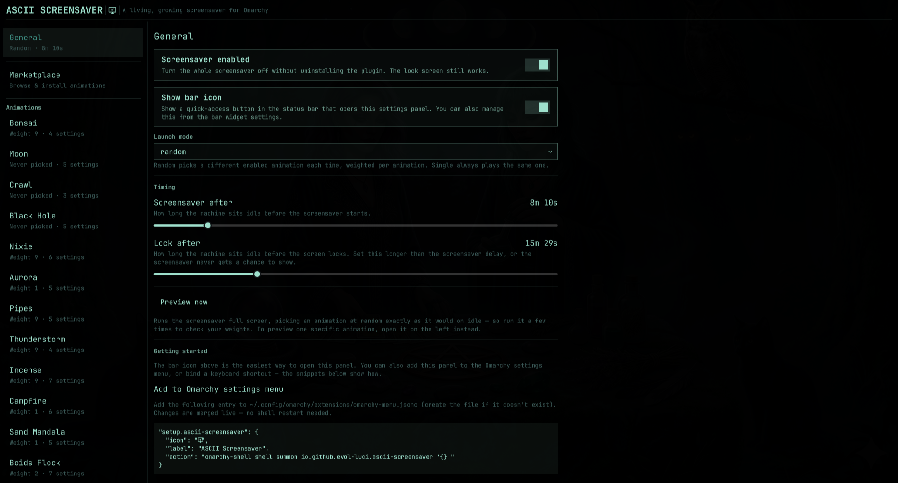

---

## Default Animations

Ten flagship animations ship enabled out of the box, picked at random with equal weight:

| Animation | Preview | Description |
| --- | --- | --- |
| **aquarium** | 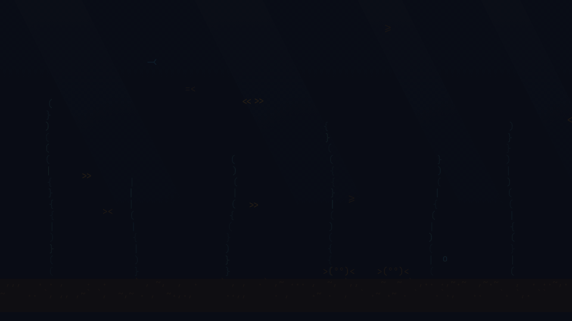 | A living reef: a fish school that schools, rests at night, flees a roaming predator, and swarms feeding events, under a day/night lighting cycle with sunbeams, bioluminescent plankton, swaying kelp, sand crabs, and an aerator stream. 5 palettes. |
| **aurora** | 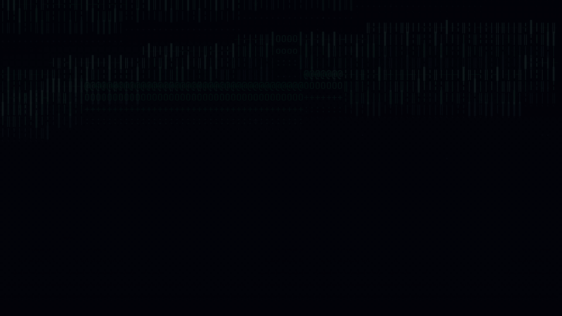 | Procedural aurora borealis ribbons over a twinkling star field. 5 palettes, adjustable band count and brightness. |
| **bonsai** | 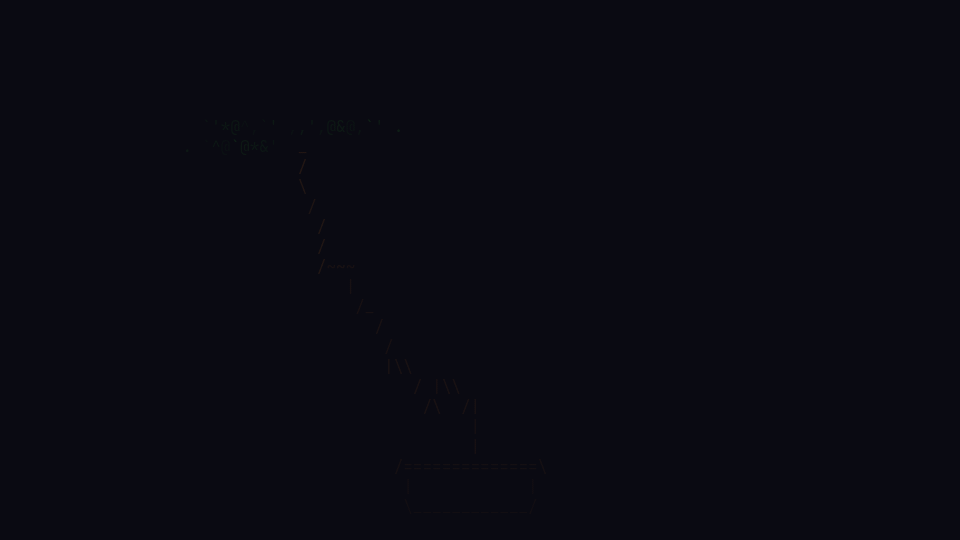 | Procedural bonsai tree that grows, holds, fades, and restarts. 6 palettes including natural, autumn, sakura, cherry, purple, and mono. |
| **incense** | 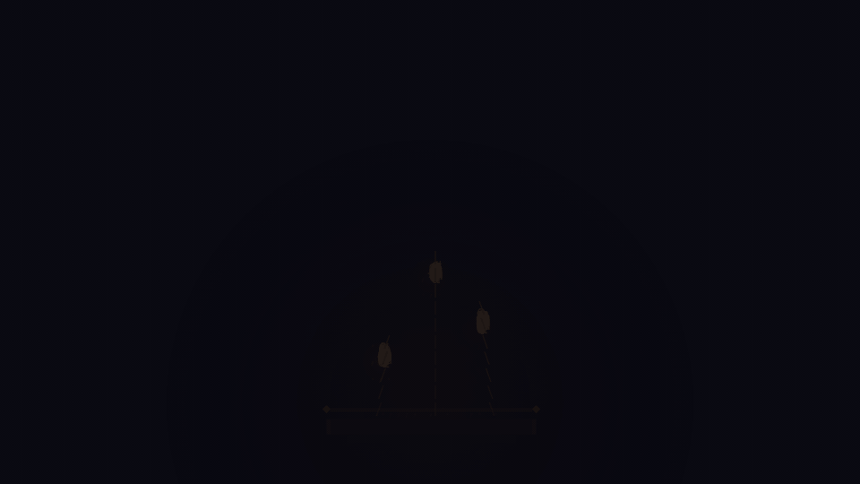 | Multi-stick incense altar with rising smoke particles, glow, ash, and sparks. 6 smoke-color palettes, wind controls. |
| **nixie** | 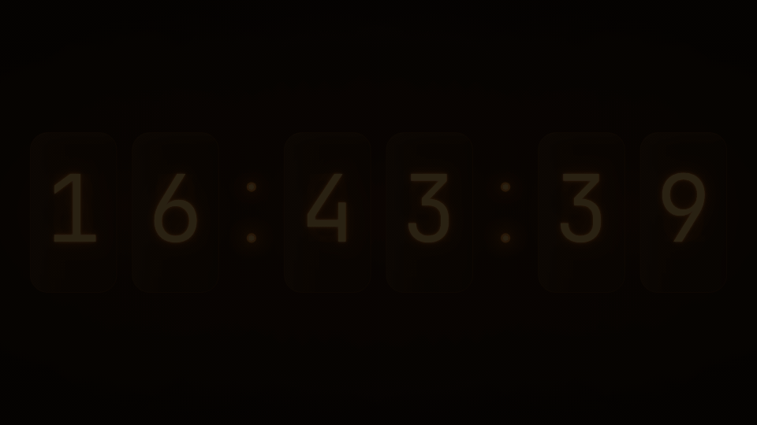 | Vintage nixie-tube clock with cathode poisoning, neon glow bloom, and per-tube flicker. Inspired by joeparadiso/nixie-tube-clock. |
| **pendulum_wave** | 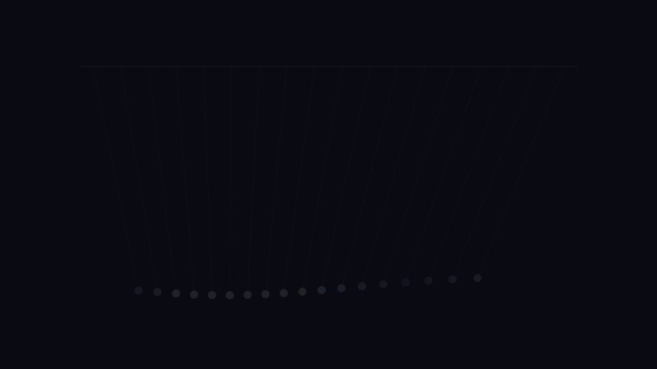 | Pendulums of progressively shorter period swinging in and out of phase — travelling waves that periodically snap back into perfect sync. |
| **pipes** | 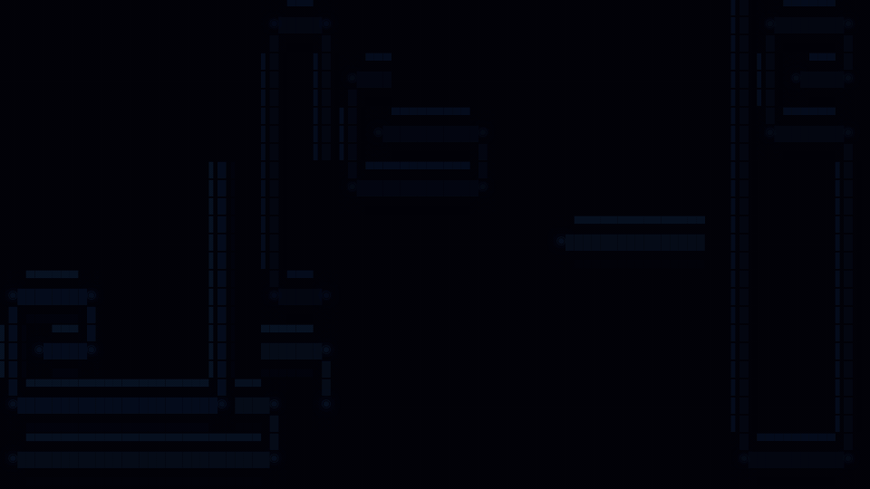 | Growing 3D-cylinder pipe network rendered with Unicode box-drawing characters. 5 palettes, adjustable density and spawn rate. |
| **sandmandala** | 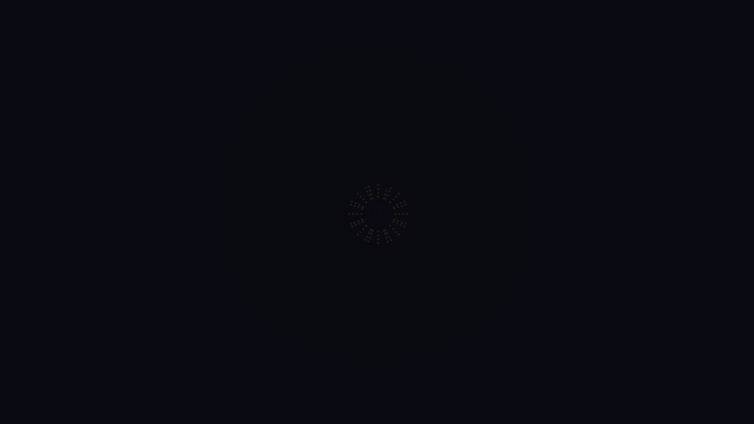 | Procedural N-fold radial-symmetry sand mandala that builds grain-by-grain, holds, then dissolves and rebuilds with a new random pattern. 5 palettes. |
| **terrarium** | 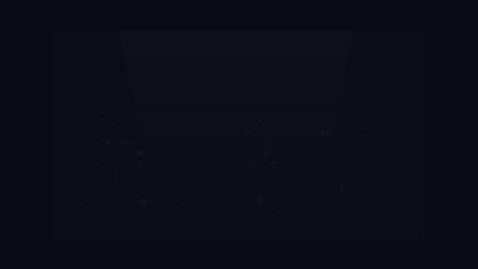 | A living glass ecosystem: plants grow, seed, wilt, and decay into litter; fungi decompose it back into soil nutrients; a 3-tier animal food web (detritivores, leaf-grazing snails, a roaming centipede predator) and a foraging ant colony cycle through it — all coupled by closed water, nutrient, and light cycles under a day/night and seasonal rhythm. Nothing goes permanently extinct. 5 palettes. |
| **thunderstorm** |  | Dynamic rain, lightning bolts, and storm clouds in ASCII. 5 palettes, adjustable wind and lightning intensity. |

That's just the start. 20 more built-in animations ship alongside these (installed but off by default), and a growing community **Marketplace** adds more all the time. Browse and enable anything from the sidebar or the Marketplace tab — see below.

---

## The Marketplace

The easiest way to get new animations is the Marketplace.

1. Open the ASCII Screensaver settings panel in Omarchy.
2. Click the **Marketplace** tab in the sidebar.
3. Browse, search, and click **Install** on any animation that catches your eye.

The animation will instantly be downloaded and added to your active rotation.

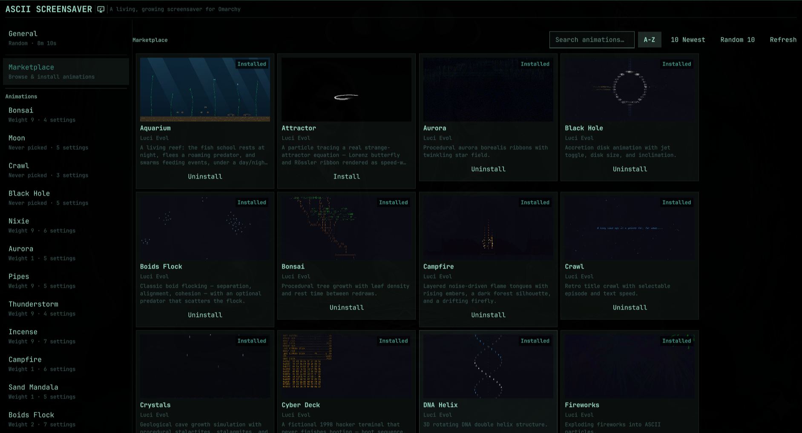

---

## Building Your Own Animation

Creating a custom animation is incredibly easy. The plugin is designed with a frictionless local development loop: the moment you drop a folder into the right place, it appears in your Omarchy panel.

### You don't need to know how to code! (The AI method)

If you don't know HTML or JavaScript, you can just point an AI (like ChatGPT, Claude, or Gemini) at this very README. Give the AI this prompt:

> "I want to build an animation for the Omarchy ASCII Screensaver plugin. Read the 'Anatomy of an Animation' section of their documentation below, and then write the complete `index.html` and `manifest.json` for a [YOUR IDEA HERE, e.g., a retro telemetry display] animation."

### The Anatomy of an Animation

An animation is just a self-contained folder with three files.

```
my-cool-animation/
├── index.html        # The animation code itself (required)
├── manifest.json     # Metadata and parameter definitions (required)
└── preview.gif       # Preview image (required for marketplace submission)
```

**Rule 1:** `index.html` must be entirely self-contained. You cannot load external scripts (`<script src="...">`), you cannot call `fetch()` to external domains, and you must inline all your CSS and JS.

**Rule 2:** The total folder size must be under 2 MB.

### Local Development Loop

To build and test locally:
1. Go to `~/.config/omarchy/ascii-screensaver/animations/` (create it if it doesn't exist).
2. Create a folder for your animation (e.g., `my-anim/`).
3. Add your `index.html` and `manifest.json`.
4. Open the Omarchy panel (or hit Refresh). **Your animation will immediately appear in the sidebar.**

### `manifest.json` Example

This file tells the plugin what your animation is, who made it, and what settings (parameters) it accepts. The `id` must exactly match your folder name.

```json
{
  "id": "my-anim",
  "name": "My Cool Animation",
  "description": "A short, human-readable description of what this does.",
  "author": "Your Name",
  "version": "1.0.0",
  "preview": "preview.gif",
  "params": [
    {
      "key": "speed",
      "type": "range",
      "label": "Speed",
      "description": "How fast the animation plays.",
      "defaultValue": 1.0,
      "min": 0.1,
      "max": 5.0,
      "step": 0.1
    },
    {
      "key": "palette",
      "type": "select",
      "label": "Color Palette",
      "defaultValue": "terminal",
      "options": ["terminal", "amber", "vaporwave"]
    }
  ]
}
```

### Reading Parameters in `index.html`

The plugin automatically takes whatever the user sets in the GUI panel and injects it into your `index.html` at runtime via a global variable called `window.animationParams`. 

At the very top of your JavaScript, just read from it:

```html
<script>
  // Read params injected by the plugin, falling back to defaults if missing
  const params = window.animationParams || {};
  const speed = params.speed ?? 1.0;
  const palette = params.palette ?? "terminal";

  // Now write your animation using `speed` and `palette`!
</script>
```

### Ideas to build!
Need inspiration? We've already built the classics (Matrix rain, fluid sims), so we're looking for fresh concepts! Try building around these broad themes:
- **Generative & Algorithmic Art**: Fractals, recursive geometric patterns, or mathematical visualizers.
- **Retro Tech & Nostalgia**: Simulated CRT monitor glitches, vintage telemetry displays, or retro operating system boot sequences.
- **Nature & Organic Systems**: Cellular automata, weather simulations, or digital ecosystems simulating flocking and growth.
- **Data & Cyberpunk**: Hacker interfaces, glowing network graphs, or cryptographic visualizers.
- **Optical Illusions**: ASCII-based perspective tricks, infinite tunnels, or moiré patterns.

---

## Submitting to the Marketplace

Once your animation looks great locally:
1. Make sure you have a `preview.gif` (or `.jpg`/`.png`) showing it in action.
2. Fork the community repository: [ascii-screensaver-animations](https://github.com/Evol-Luci/ascii-screensaver-animations)
3. Drop your folder into the `animations/` directory.
4. Open a Pull Request! A GitHub Actions bot will automatically validate your submission.

---

## Installation (Plugin)

This is an [Omarchy](https://omarchy.org) plugin (requires Omarchy Quattro or later). Install the base plugin with:

```bash
omarchy plugin add https://github.com/Evol-Luci/ascii_screensaver_plugin_omarchy.git --enable
```

This clones the repo into `~/.config/omarchy/plugins/io.github.evol-luci.ascii-screensaver/` and enables it immediately. The screensaver replaces Omarchy's built-in one right away. 

### Removal

```bash
omarchy plugin remove io.github.evol-luci.ascii-screensaver
```

Because this cleanly overrides Omarchy's idle behavior, removing the plugin restores the default system idle service exactly. User configurations and downloaded animations are safely preserved in `~/.config/omarchy/ascii-screensaver/` in case you reinstall later.

### Configuring Animations

The plugin ships a native settings panel. Open it via the bar widget (the monitor icon 󱄄 in your bar) or from the terminal:

```bash
omarchy-shell shell summon io.github.evol-luci.ascii-screensaver '{}'
```

From here, you can browse installed animations, tweak their weights/parameters, test them via the **Preview this animation** button, and browse the **Marketplace**.

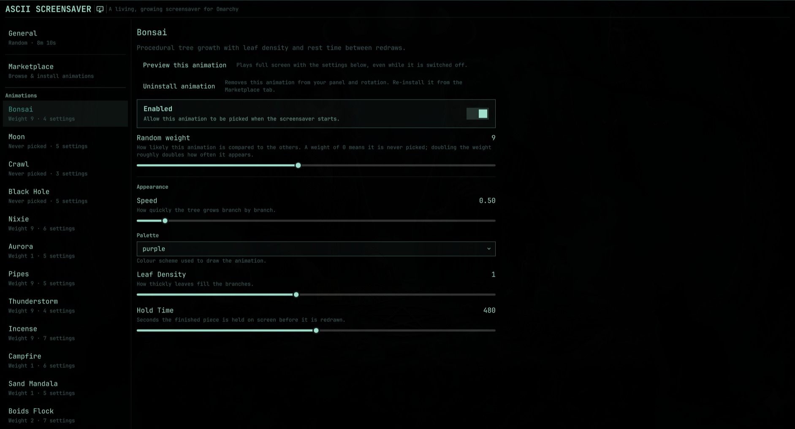
