# ASCII Screensaver

A modular, multi-animation ASCII screensaver plugin for [Omarchy](https://omarchy.org), designed for Linux/Wayland desktops running Hyprland. Animations run as fullscreen Chromium kiosk windows and are triggered automatically by Omarchy's idle service.


## Features

- **30 Unique Animations:** From procedural bonsai trees to gravitational lensing black holes and realtime fluid dynamics.
- **Native Settings Panel:** A visual configuration UI built directly into the Omarchy shell lets you tune every parameter, test animations with live previews, and set probabilities—without ever touching a JSON file.
- **Multi-Monitor Support:** Automatically launches and synchronizes screensavers across all connected displays.
- **Zero Dependencies for Animations:** All 30 screensavers run as plain, dependency-free HTML/JS via Chromium kiosk mode.
- **Fully Customizable:** Easily tweak colors, speeds, densities, and more for each individual animation.

---

## Animations

| Name | Preview | Description |
|------|---------|-------------|
| **bonsai** | 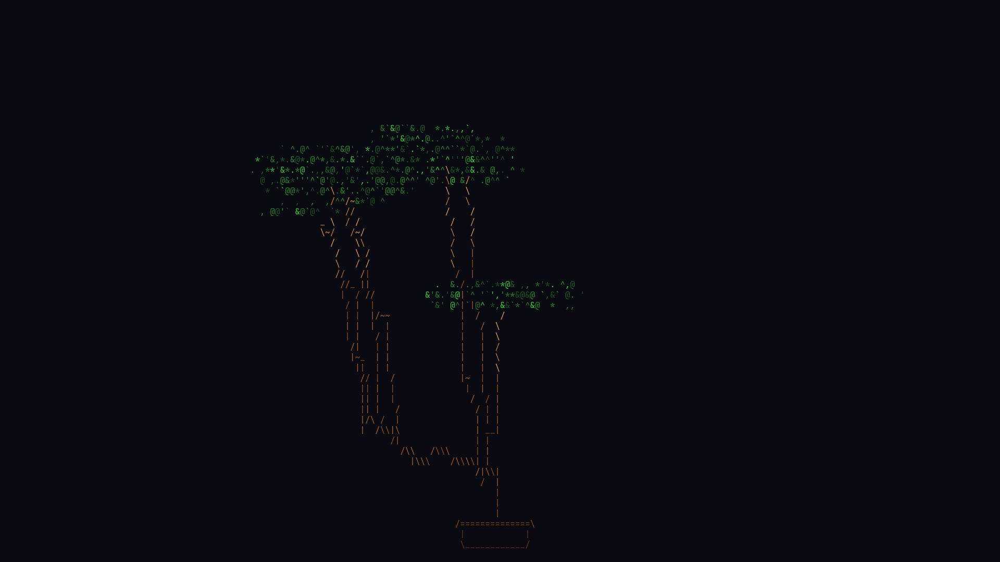 | Procedural bonsai tree that grows, holds, fades, and restarts. 6 palettes including natural, autumn, sakura, cherry, purple, and mono. |
| **moon** | 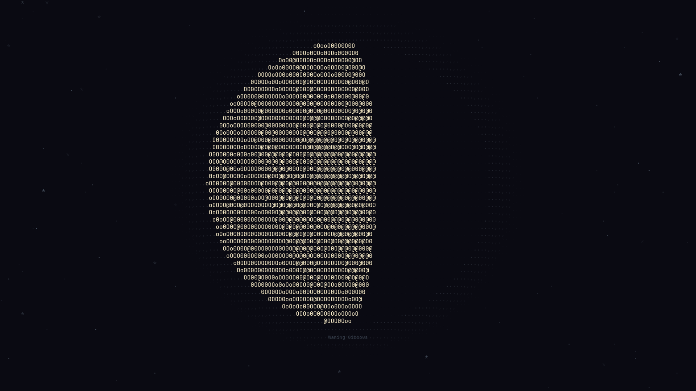 | Orbital lunar phase cycle with limb darkening, glow halo, twinkling stars, gravitational lensing, and random space floaters. 5 palettes. |
| **crawl** |  | Perspective Star Wars–style title crawl with 4 original episodes, 5 color palettes, and selectable or random episode order. |
| **blackhole** | 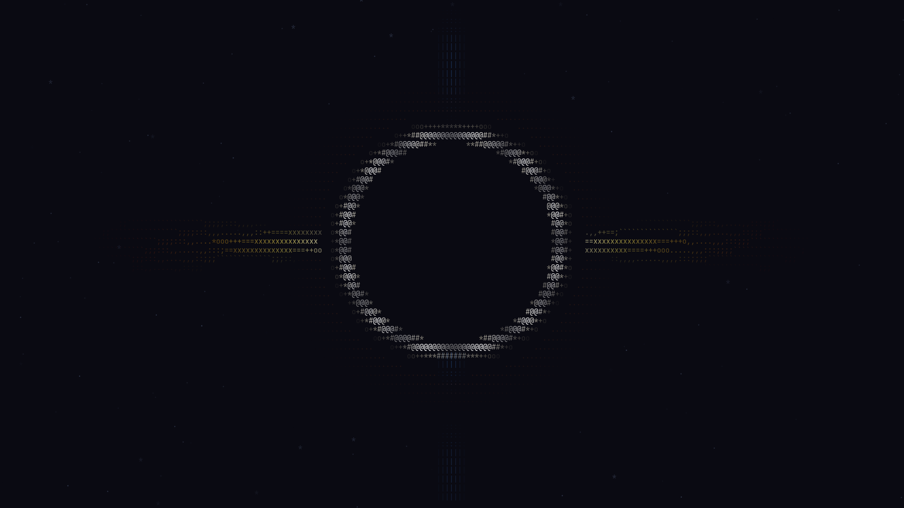 | Accretion disk with Schwarzschild-inspired gravitational lensing, Doppler brightening, relativistic jets, and photon ring. 4 palettes. |
| **aurora** | 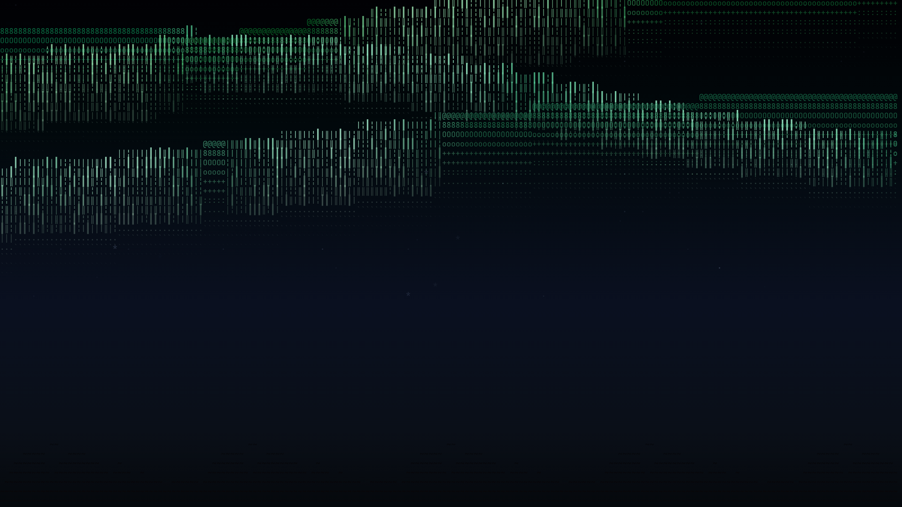 | Procedural aurora borealis ribbons over a twinkling star field. 5 palettes, adjustable band count and brightness. |
| **mandelbrot** |  | Zooming ASCII fractal renderer with auto-jumping boundary regions. 5 palettes, 3 charsets. |
| **pipes** | 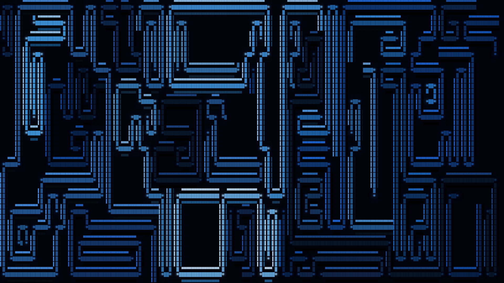 | Growing 3D-cylinder pipe network rendered with Unicode box-drawing characters. 5 palettes, adjustable density and spawn rate. |
| **fluid** | 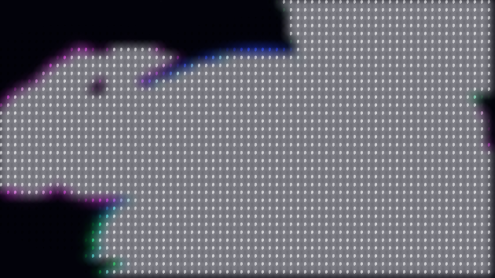 | Real-time fluid dynamics simulation with dye injection, rendered in ASCII. 4 resolution tiers, 5 palettes. |
| **thunderstorm** |  | Dynamic rain, lightning bolts, and storm clouds in ASCII. 5 palettes, adjustable wind and lightning intensity. |
| **incense** |  | Multi-stick incense altar with rising smoke particles, glow, ash, and sparks. 6 smoke-color palettes, wind controls. |
| **campfire** | 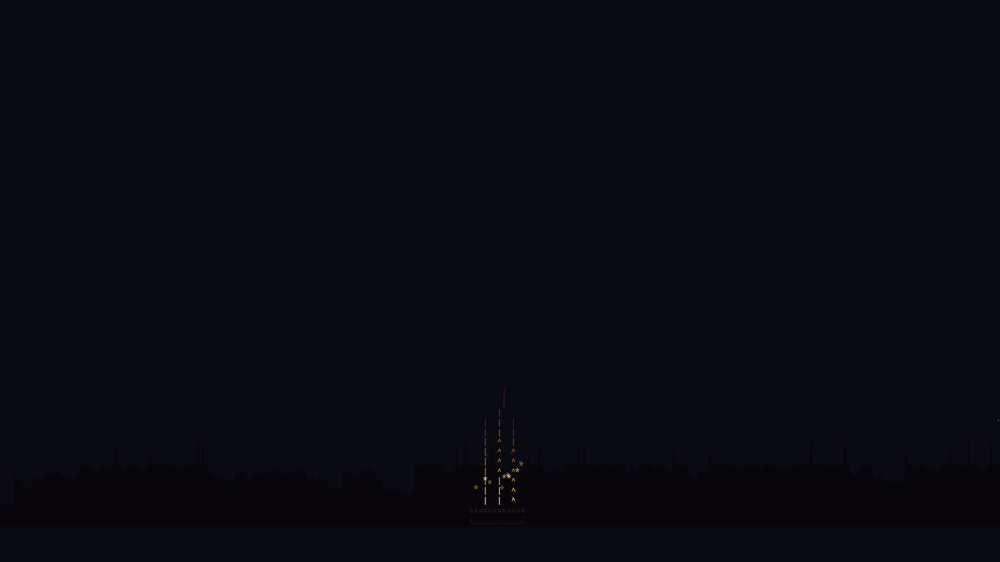 | Crackling campfire with layered noise-driven flame tongues, rising embers, a dark forest silhouette, and a drifting firefly. 5 flame-color palettes. |
| **nixie** | 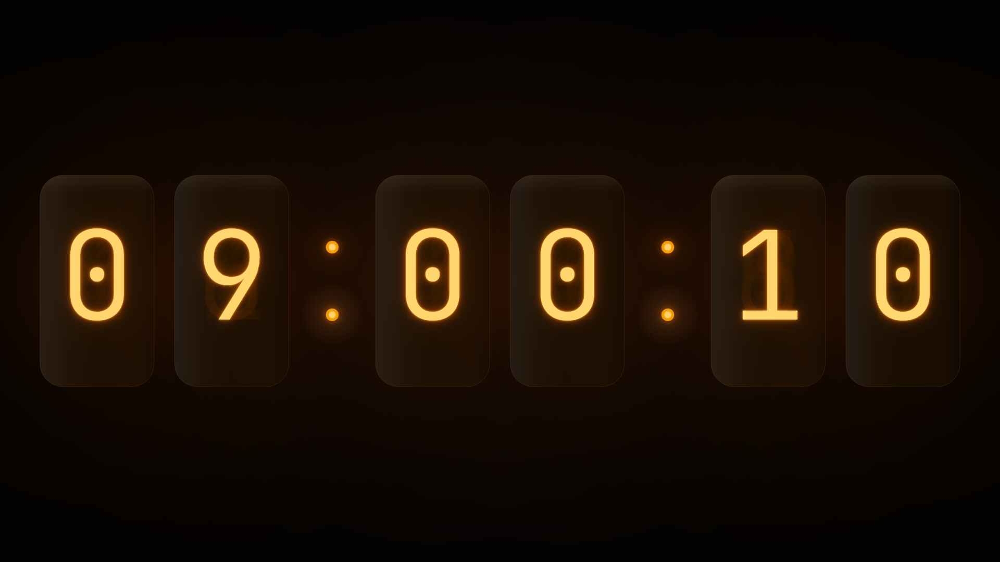 | Vintage nixie-tube clock with cathode poisoning, neon glow bloom, and per-tube flicker. Inspired by joeparadiso/nixie-tube-clock. |
| **planet** | 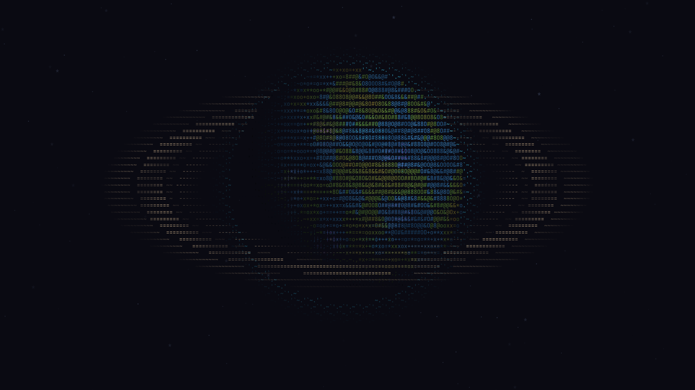 | Rotating ASCII planet sphere with atmosphere, optional rings, and polar aurora. 7 planet colors, 6 atmosphere colors. |
| **gameoflife** | 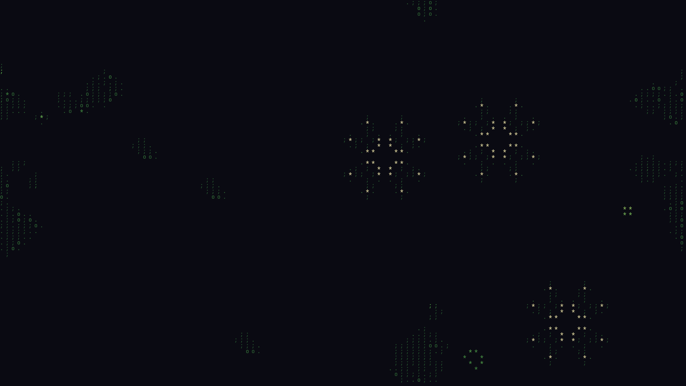 | Conway's Game of Life rendered as a growing/wilting ASCII garden — cell age maps to seedling/sprout/flower/wilt glyphs. Auto-reseeds with random fills or classic patterns on stagnation or extinction. 4 palettes. |
| **sandmandala** | 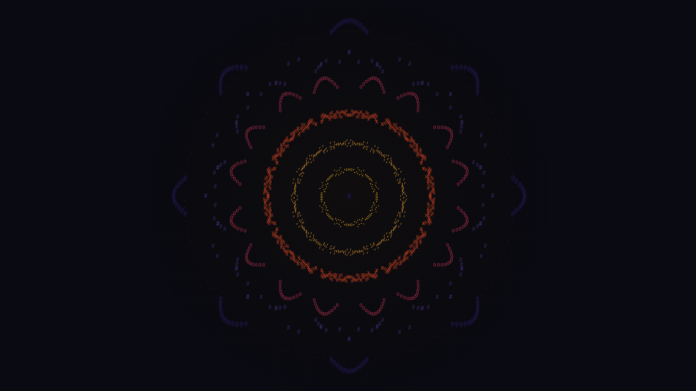 | Procedural N-fold radial-symmetry sand mandala that builds grain-by-grain, holds, then dissolves and rebuilds with a new random pattern. 5 palettes. |
| **boids** | 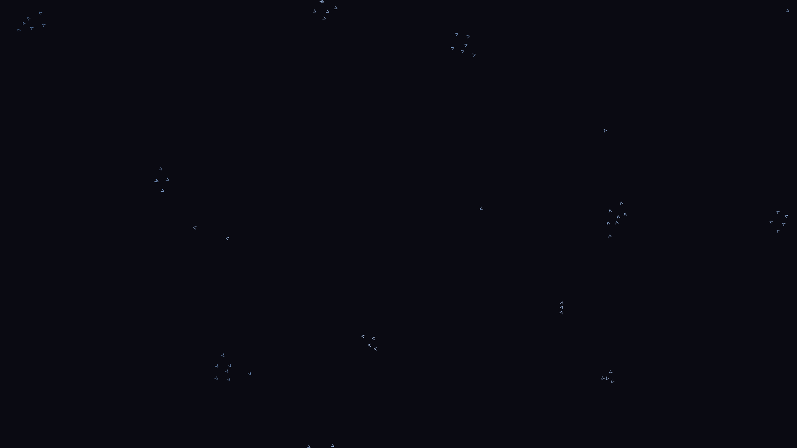 | Flock of triangular glyphs under classic separation/alignment/cohesion boid rules, with an optional scattering predator. 4 palettes, adjustable flock size and rule weights. |
| **windchimes** | 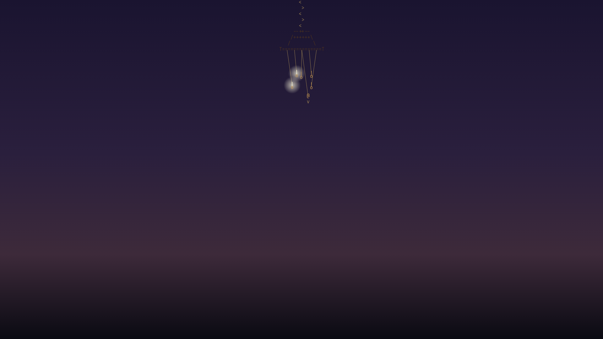 | Hanging chime tubes swaying as damped pendulums in a noise-driven gusty breeze, with proximity-triggered glint flashes and procedurally synthesized bell tones (press M to toggle sound). 5 material palettes. |
| **vinyl** | 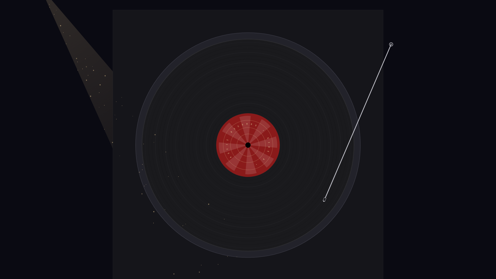 | Top-down spinning vinyl record with rotating groove sheen, a procedural radial label, a tonearm that tracks inward over the track's runtime, and lamplit dust motes. 5 palettes. |
| **waterfall** | 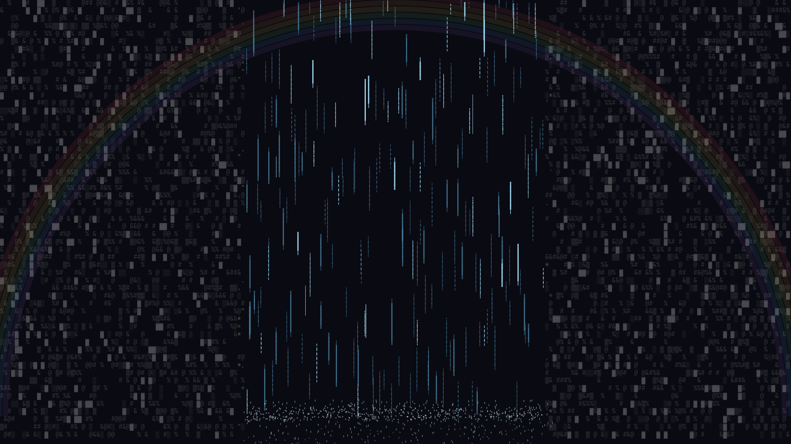 | Cascading waterfall through a mossy rock channel with a base mist/spray burst and optional rainbow arc. 5 water-color palettes. |
| **jellyfish** | 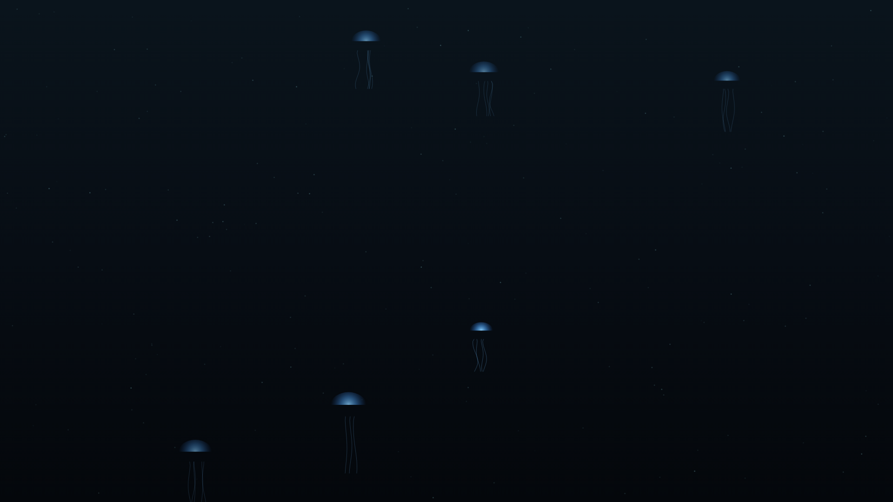 | Bioluminescent jellyfish drifting through deep-sea darkness with pulsing bell glow, wavy trailing tentacles, and plankton sparkle. 5 palettes. |
| **terrarium** | 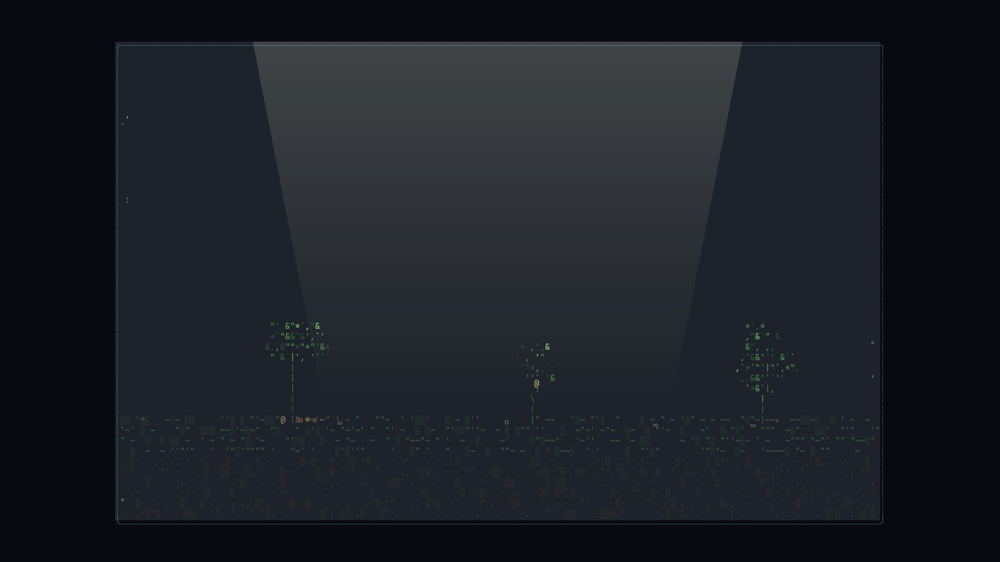 | A living glass ecosystem: plants grow, seed, wilt, and decay into litter; fungi decompose it back into soil nutrients; a 3-tier animal food web (detritivores, leaf-grazing snails, a roaming centipede predator) and a foraging ant colony cycle through it — all coupled by closed water, nutrient, and light cycles under a day/night and seasonal rhythm. Nothing goes permanently extinct. 5 palettes. |
| **aquarium** | 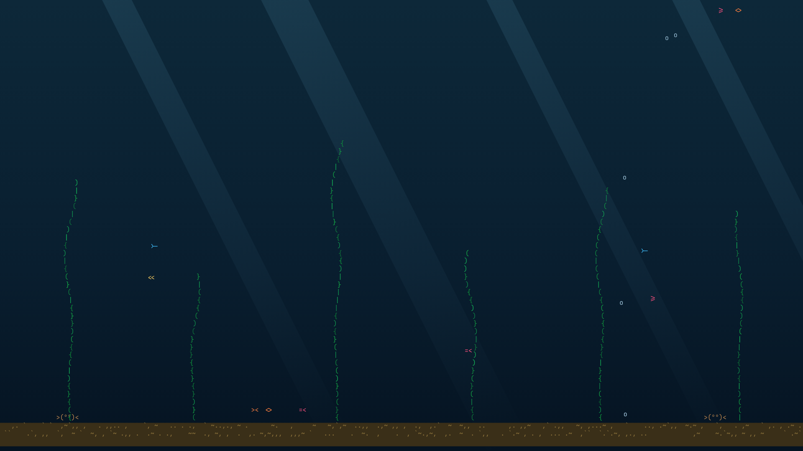 | A living reef: a fish school that schools, rests at night, flees a roaming predator, and swarms feeding events, under a day/night lighting cycle with sunbeams, bioluminescent plankton, swaying kelp, sand crabs, and an aerator stream. 5 palettes. |
| **spiderweb** |  | A spider builds its web strand by strand, hunts drifting prey, and survives wasp raids and telegraphed bird strikes that tear the web — then repairs the damage. Dew glints on finished strands, fireflies drift past, and a soft moon glows behind it all. 5 palettes; adjustable build pacing, prey/predator rates, sway, dew, and moonlight. |
| **volcano** | 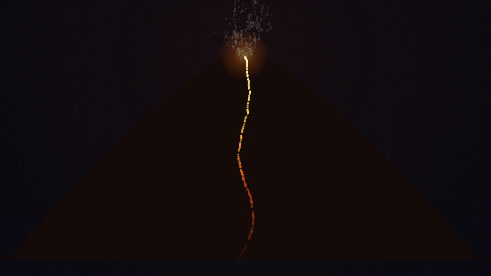 | Night mountain with a glowing crater, lava flowing down a fixed channel, eruption sparks, and a rising smoke plume. 5 lava-color palettes. |
| **oscilloscope** | 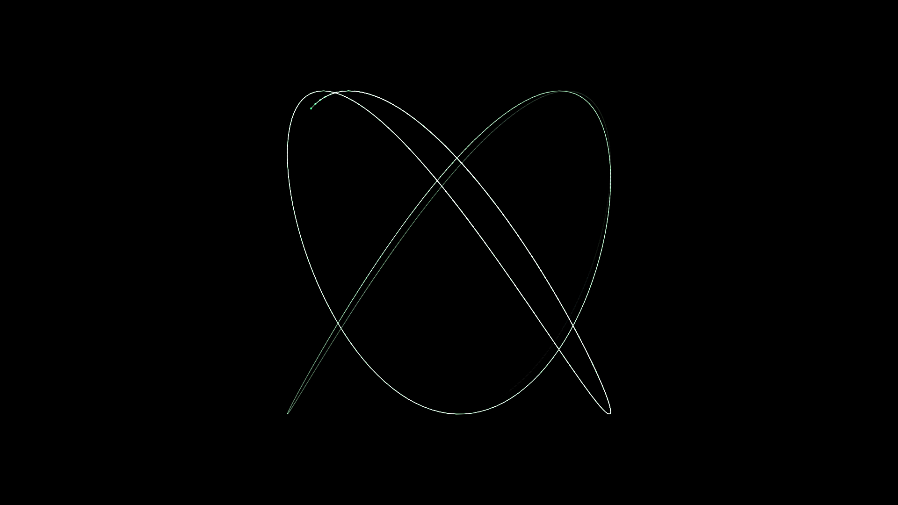 | A CRT laboratory instrument left running forever — glowing phosphor Lissajous traces with decay, scanlines, and bloom. Vector rendering with speed-dependent brightness and multi-layer phosphor glow. |
| **pendulum_wave** | 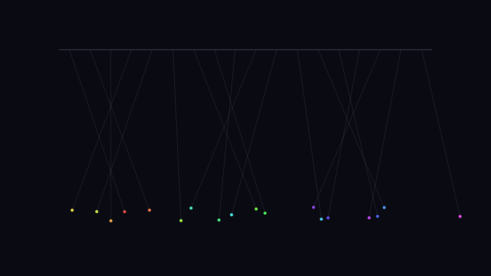 | Pendulums of progressively shorter period swinging in and out of phase, producing traveling-wave illusions that periodically snap back into sync. |
| **glitch_field** | 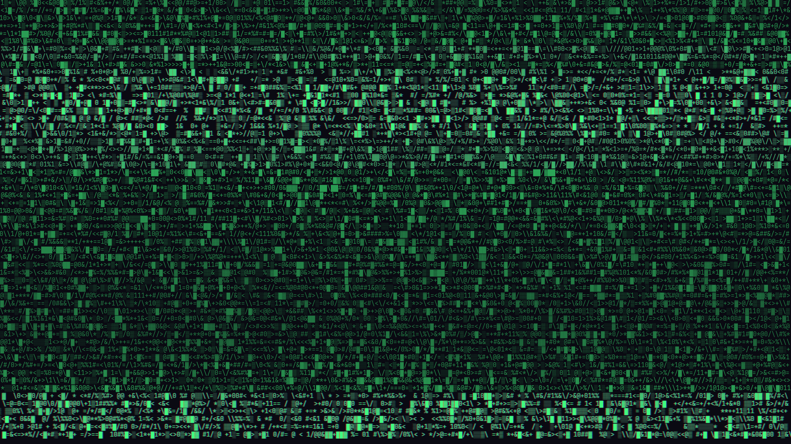 | A broken digital reality — a character grid torn by drifting corruption bands, RGB split, scanline tearing and packet loss. |
| **cyber_deck** |  | A fictional 1998 hacker terminal that never finishes booting — boot sequences, hex dumps, hardware diagrams, and glitches with occasional kernel panics. |
| **attractor** | 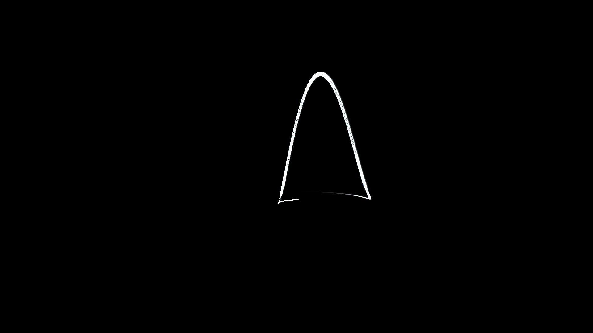 | A particle tracing a real Lorenz/Rössler strange-attractor equation as speed-weighted ASCII glyphs through a rotating 3D camera |

---

## Architecture

`Service.qml` is a clone of Omarchy's first-party `omarchy.idle` service
(installed via the `omarchy.clonedFrom` mechanism, so disabling this
plugin restores the built-in idle behavior exactly). On screensaver
timeout it runs `bin/ascii-screensaver-launch`, which picks an animation
per `screensaver-config.json`, then launches one Chromium kiosk window
per monitor — tagged `--class=org.omarchy.screensaver` so Omarchy's idle
service can track it — via `bin/ascii-screensaver-cmd`. All 30 animations
under `animations/` are plain, dependency-free HTML/JS, unchanged by this
plugin migration.
## Configuration

Configure this plugin through the native settings panel described in
[Configuring animations](#configuring-animations) below — it runs inside
the Omarchy shell itself, needs nothing extra running, and covers every
animation's parameters: global enable/disable, launch mode, per-animation
enable/disable and weight, every animation's params, and a live preview.


### Manual JSON editing

Edit `screensaver-config.json` directly. The launcher reads it fresh on every activation, so changes take effect immediately — no restart needed.

**Top-level fields:**

```json
{
  "enabled": true,
  "mode": "random",
  "selectedAnimation": "crawl",
  "animations": [ ... ]
}
```

| Field | Values | Description |
|-------|--------|-------------|
| `enabled` | `true`/`false` | Master kill switch |
| `mode` | `"random"` / `"single"` | Random weighted pick or always use `selectedAnimation` |
| `selectedAnimation` | animation name | Used only when `mode` is `"single"` |

**Per-animation fields:**

```json
{
  "name": "bonsai",
  "enabled": true,
  "weight": 5,
  "params": { "speed": 1.0, "palette": "sakura" }
}
```

| Field | Description |
|-------|-------------|
| `enabled` | Include this animation in random selection |
| `weight` | Relative probability — higher = picked more often. Set to `0` to exclude without disabling. |
| `params` | Animation-specific parameters (see below) |

### Animation parameters

**bonsai**

| Param | Type | Default | Description |
|-------|------|---------|-------------|
| `speed` | float | `1.0` | Growth speed multiplier |
| `palette` | string | `natural` | `natural` `autumn` `sakura` `cherry` `purple` `mono` |
| `leafDensity` | float | `1.0` | Scales number of falling leaves |
| `holdTime` | int | `360` | Frames to hold fully grown tree (~6s at 60fps) |

**moon**

| Param | Type | Default | Description |
|-------|------|---------|-------------|
| `speed` | float | `1.0` | Phase cycle speed multiplier |
| `palette` | string | `silver` | `silver` `gold` `blood` `blue` `green` |
| `stars` | int | `120` | Number of background stars |
| `floaterFreq` | float | `1.0` | Space floater spawn rate multiplier |
| `glowIntensity` | float | `1.0` | Glow halo radius multiplier |

**crawl**

| Param | Type | Default | Description |
|-------|------|---------|-------------|
| `speed` | float | `1.0` | Scroll speed multiplier |
| `palette` | string | `gold` | `gold` `white` `green` `blue` `red` |
| `episode` | int | `-1` | Episode 0–3, or `-1` for random each cycle |

**blackhole**

| Param | Type | Default | Description |
|-------|------|---------|-------------|
| `speed` | float | `1.0` | Animation speed multiplier |
| `palette` | string | `fire` | `fire` `cool` `plasma` `mono` |
| `diskSize` | float | `1.0` | Scales outer disk radius |
| `jets` | int | `1` | `1` to show relativistic jets, `0` to hide |
| `inclination` | float | `0.36` | Disk tilt — `0` = edge-on, `1` = face-on |

**aurora**

| Param | Type | Default | Description |
|-------|------|---------|-------------|
| `speed` | float | `1.0` | Animation speed multiplier |
| `palette` | string | `aurora` | `aurora` `northern` `southern` `neon` `mono` |
| `bands` | int 1–5 | `3` | Number of aurora ribbons |
| `brightness` | float | `1.0` | Ribbon brightness multiplier |
| `stars` | int | `150` | Number of background stars |

**mandelbrot**

| Param | Type | Default | Description |
|-------|------|---------|-------------|
| `speed` | float | `1.0` | Zoom/animation speed multiplier |
| `palette` | string | `classic` | `classic` `fire` `ocean` `neon` `mono` |
| `maxIter` | int | `64` | Max fractal iteration depth (16–256) |
| `charset` | string | `classic` | `classic` `blocks` `dots` |
| `autoJump` | 0/1 | `1` | Automatically jump to new boundary regions when zoomed in |

**pipes**

| Param | Type | Default | Description |
|-------|------|---------|-------------|
| `speed` | float | `1.0` | Animation speed multiplier |
| `palette` | string | `blue` | `blue` `green` `amber` `neon` `mono` |
| `density` | int 1–12 | `6` | Number of concurrent pipes |
| `fading` | 0/1 | `1` | Fade out old pipe segments |
| `spawnRate` | float | `1.0` | New pipe spawn rate multiplier |

**fluid**

| Param | Type | Default | Description |
|-------|------|---------|-------------|
| `speed` | float | `1.0` | Simulation speed multiplier |
| `palette` | string | `plasma` | `plasma` `ocean` `fire` `neon` `mono` |
| `resolution` | string | `medium` | `low` `medium` `high` `ultra` — simulation grid density |
| `diffusion` | float | `0.0001` | Dye diffusion rate (0–0.01) |
| `viscosity` | float | `0` | Fluid viscosity (0–0.001) |
| `dyeFade` | float | `0.995` | Dye fade-out rate per frame (0.98–1) |

**thunderstorm**

| Param | Type | Default | Description |
|-------|------|---------|-------------|
| `intensity` | float | `1.0` | Rain intensity multiplier |
| `wind` | float | `0.3` | Wind direction/strength (-1 to 1) |
| `lightning` | float | `1.0` | Lightning strike frequency multiplier |
| `palette` | string | `tempest` | `tempest` `tropical` `desert` `arctic` `mono` |

**incense**

| Param | Type | Default | Description |
|-------|------|---------|-------------|
| `speed` | float | `1.0` | Animation speed multiplier |
| `smokeDensity` | float | `1.0` | Smoke particle density multiplier |
| `smokeLifespan` | float | `1.0` | Smoke particle lifespan multiplier |
| `smokeColor` | string | `warm` | `warm` `cool` `incense` `sage` `lavender` `mono` |
| `windDirection` | float | `0.0` | Wind direction (-1 to 1) |
| `windSpeed` | float | `0.3` | Wind speed (0–2) |
| `randomization` | float | `0.8` | Particle motion randomness (0–2) |

**campfire**

| Param | Type | Default | Description |
|-------|------|---------|-------------|
| `speed` | float | `1.0` | Flicker/animation speed multiplier |
| `palette` | string | `warm` | `warm` `blueFlame` `greenFlame` `violetFlame` `mono` |
| `flameHeight` | float | `1.0` | Flame tongue height scale (0.5–2.0) |
| `emberRate` | float | `1.0` | Ember/spark spawn rate multiplier (0–2) |
| `crackleIntensity` | float | `1.0` | Flicker/jitter amount (0–2) |
| `forestSilhouette` | 0/1 | `1` | Show background forest silhouette |

**nixie**

| Param | Type | Default | Description |
|-------|------|---------|-------------|
| `glowColor` | string | `amber` | `amber` `red` `green` `blue` `white` `purple` |
| `flickerIntensity` | float | `1.0` | Tube flicker intensity (0–2) |
| `poisoningSpeed` | float | `1.5` | Cathode poisoning animation speed (0.5–4) |
| `showSeconds` | 0/1 | `1` | Show a seconds tube |
| `tubeStyle` | string | `classic` | `classic` `slim` `wide` |
| `tubeColons` | 0/1 | `0` | Show colon separators between tubes |

**planet**

| Param | Type | Default | Description |
|-------|------|---------|-------------|
| `speed` | float | `0.5` | Rotation speed multiplier |
| `planetColor` | string | `earth` | `earth` `mars` `ice` `gas` `lava` `ocean` `mono` |
| `planetSize` | float | `1.0` | Planet radius scale (0.3–1.5) |
| `rings` | 0/1 | `1` | Show planetary rings |
| `atmosphereColor` | string | `cyan` | `cyan` `amber` `violet` `green` `red` `white` |
| `atmosphereDensity` | float | `1.0` | Atmosphere haze density (0–2) |
| `atmosphereTurbulence` | float | `0.6` | Atmosphere turbulence (0–2) |
| `atmosphereDirection` | float | `0.3` | Atmosphere flow direction (-1 to 1) |
| `aurora` | 0/1 | `1` | Show polar aurora effect |

**gameoflife**

| Param | Type | Default | Description |
|-------|------|---------|-------------|
| `speed` | float | `1.0` | Generation tick speed multiplier |
| `palette` | string | `spring` | `spring` `autumn` `neon` `mono` |
| `cellSize` | int | `16` | Grid cell size in px |
| `density` | float 0–1 | `0.35` | Initial/reseed fill density |
| `reseedMode` | string | `mixed` | `random` `classic` `mixed` — reseed pattern source on stagnation |

**sandmandala**

| Param | Type | Default | Description |
|-------|------|---------|-------------|
| `speed` | float | `1.0` | Grain-placement speed multiplier |
| `palette` | string | `tibetan` | `tibetan` `desert` `ocean` `jewel` `mono` |
| `symmetry` | int | `8` | Radial fold count: `4` `6` `8` `12` |
| `holdTime` | int | `300` | Frames to hold the completed mandala |
| `dissolveStyle` | string | `wind` | `sweep` `wind` `fade` |

**boids**

| Param | Type | Default | Description |
|-------|------|---------|-------------|
| `speed` | float | `1.0` | Simulation speed multiplier |
| `palette` | string | `birds` | `birds` `fish` `abstract` `mono` |
| `flockSize` | int | `60` | Number of agents (20–150) |
| `cohesion` | float | `1.0` | Cohesion rule weight (0–2) |
| `separation` | float | `1.0` | Separation rule weight (0–2) |
| `predator` | 0/1 | `0` | Spawn a predator agent that scatters the flock |
| `predatorSpeed`| float| `1.35`| Predator speed multiplier (0.5–3.0) |

**windchimes**

| Param | Type | Default | Description |
|-------|------|---------|-------------|
| `speed` | float | `1.0` | Sway/gust speed multiplier |
| `palette` | string | `bronze` | `bronze` `silver` `bamboo` `glass` `mono` |
| `chimeCount` | int | `5` | Number of hanging chimes (3–7) |
| `windStrength` | float | `1.0` | Base gust strength (0–2) |
| `gustFrequency` | float | `1.0` | How often gusts cycle (0–2) |
| `doublePendulum` | 0/1 | `0` | Swap the central clapper for a chaotic two-segment double pendulum |
| `soundType` | string | `bell` | Bell timbre preset: `bell` `crystal` `wood` `gong` |
| `pitch` | float | `2.0` | Root-frequency multiplier — tunes the whole set up/down (2.0–5.0) |

Sound playback is a runtime-only toggle (press **M**), off by default; `soundType` only selects which timbre is used when sound is enabled.

**vinyl**

| Param | Type | Default | Description |
|-------|------|---------|-------------|
| `speed` | float | `1.0` | RPM-style rotation speed multiplier |
| `palette` | string | `vinylBlack` | `vinylBlack` `red` `blue` `gold` `mono` |
| `dustDensity` | float | `1.0` | Dust mote density in the lamp cone (0–2) |
| `lampGlow` | float | `1.0` | Lamp-light cone glow intensity (0–2) |

**waterfall**

| Param | Type | Default | Description |
|-------|------|---------|-------------|
| `speed` | float | `1.0` | Flow speed multiplier |
| `palette` | string | `clear` | `clear` `glacier` `jungle` `moonlit` `mono` |
| `flowDensity` | float | `1.0` | Water particle density (0–2) |
| `mistIntensity` | float | `1.0` | Base spray particle density (0–2) |
| `rainbow` | 0/1 | `1` | Show faint rainbow arc |

**jellyfish**

| Param | Type | Default | Description |
|-------|------|---------|-------------|
| `speed` | float | `1.0` | Pulse/drift speed multiplier |
| `palette` | string | `blue` | `blue` `purple` `teal` `pink` `mono` |
| `jellyfishCount` | int | `6` | Number of jellyfish (3–10) |
| `glowIntensity` | float | `1.0` | Bell glow alpha multiplier (0–2) |
| `driftCurrents` | float | `1.0` | Lateral current drift strength (0–2) |

**terrarium**

| Param | Type | Default | Description |
|-------|------|---------|-------------|
| `speed` | float | `1.0` | Growth speed multiplier |
| `palette` | string | `mossy` | `mossy` `tropical` `desert` `autumn` `mono` |
| `plantDensity` | int 1–5 | `3` | Number of plant slots (re-seed to this target) |
| `condensation` | float | `1.0` | Droplet density on the glass; also gates the rain cycle, `0` = no rain (0–2) |
| `growthCycle` | string | `loop` | `loop` (grow/seed/wilt/decay repeatedly) or `static` (grow once and hold, no death/events) |
| `cycleTime` | float | `8.0` | Day→night cycle length in minutes; `0` = fixed day |
| `seasonTime` | float | `24.0` | Wet→dry season length in minutes; `0` = fixed mild season |
| `faunaRate` | float | `1.0` | Animal & ant population scale; `0` = botanical (plants + fungi only) (0–3) |
| `predatorRate` | float | `1.0` | Centipede predator visit frequency; `0` = no predator (0–3) |

**aquarium**

| Param | Type | Default | Description |
|-------|------|---------|-------------|
| `speed` | float | `1.0` | Global time/speed multiplier |
| `palette` | string | `tropical` | `tropical` `deepsea` `freshwater` `neon` `mono` |
| `fishCount` | int 5–20 | `10` | School size (kept stable via respawn) |
| `kelpDensity` | float | `1.0` | Kelp strands; also flee-cover (0–2) |
| `bubbleRate` | float | `1.0` | Aerator bubble spawn rate (0–2) |
| `cycleTime` | float | `8.0` | Day→night cycle length in minutes; `0` = fixed day |
| `predatorRate` | float | `1.0` | Predator-event frequency; `0` = off (0–3) |
| `feedRate` | float | `1.0` | Feeding-event frequency; `0` = off (0–3) |

**spiderweb**

| Param | Type | Default | Description |
|-------|------|---------|-------------|
| `speed` | float | `1.0` | Global time / spider speed multiplier |
| `palette` | string | `moonlit` | `moonlit` `dawn` `amber` `frost` `mono` |
| `pacing` | string | `medium` | Web build speed: `brisk` `medium` `slow` `glacial` |
| `webSway` | float | `1.0` | Wind / gust sway amplitude (0–3) |
| `dewDensity` | float | `1.0` | Dew droplets on built strands (0–3) |
| `preyRate` | float | `1.0` | Prey spawn frequency multiplier (0–3) |
| `predatorRate` | float | `1.0` | Wasp/bird event frequency multiplier (0–3) |
| `moonGlow` | float | `1.0` | Moonlight glow intensity (0–3) |

**volcano**

| Param | Type | Default | Description |
|-------|------|---------|-------------|
| `speed` | float | `1.0` | Flow/eruption speed multiplier |
| `palette` | string | `classic` | `classic` `sulfur` `obsidian` `blueFlame` `mono` |
| `flowIntensity` | float | `1.0` | Lava particle density (0–2) |
| `eruptionRate` | float | `1.0` | Crater spark/ember spawn rate (0–2) |
| `smokeDensity` | float | `1.0` | Plume smoke particle density (0–2) |

**oscilloscope**

| Param | Type | Default | Description |
|-------|------|---------|-------------|
| `speed` | float | `1.0` | Animation speed multiplier |
| `complexity` | int 1–6 | `3` | Detail knob — Lissajous ratio, rose petal count, polygon sides, waveform cycles |
| `phosphorDecay` | float 0.80–0.99 | `0.92` | Phosphor fade retention per frame — higher = longer ghosting trail |
| `noise` | float 0–1 | `0.2` | Wobble/jitter amplitude to keep the trace dynamic |
| `palette` | string | `phosphor` | `phosphor` `amber` `blue` |
| `shapeSet` | string | `all` | Which shapes are in the auto-cycle rotation: `all` `curves` `geometric` `waveforms` |
| `cyclePeriod` | float 4–40 | `14` | Seconds each shape is held before morphing to the next |
| `morphTime` | float 0.3–5 | `1.5` | Duration in seconds of the smooth morph between shapes |

**pendulum_wave**

| Param | Type | Default | Description |
|-------|------|---------|-------------|
| `speed` | float 0.05–1 | `0.25` | Animation speed multiplier |
| `palette` | string | `spectrum` | `spectrum` `warm` `cool` `mono` |
| `pendulumCount` | int 8–24 | `18` | Number of pendulums |
| `cycleTime` | float 4–16 | `8.0` | Seconds per full synchronization cycle |
| `swingAngle` | float 0.1–0.8 | `0.4` | Max swing angle in radians |

**glitch_field**

| Param | Type | Default | Description |
|-------|------|---------|-------------|
| `speed` | float | `1.0` | Animation speed multiplier |
| `palette` | string | `terminal` | `terminal` `amber` `vapor` `mono` |
| `density` | float 0–1 | `0.8` | Base character grid fill density |
| `corruptionRate` | float 0–1 | `0.2` | Corruption spike speed in bands |
| `scanBands` | int 0–6 | `3` | Number of horizontal corruption bands |
| `chaos` | float 0–2 | `1.0` | Corruption effect intensity multiplier |

**cyber_deck**

| Param | Type | Default | Description |
|-------|------|---------|-------------|
| `speed` | float | `1.0` | Animation speed multiplier |
| `terminalStyle` | string | `amber` | `amber` `green` `blue` |
| `corruption` | float 0–1 | `0.2` | Glitch and panic frequency |
| `bootCycle` | int 0–1 | `1` | If `0`, freeze on panic screen; if `1`, reboot |
| `scrollSpeed` | int 1–20 | `8` | Lines per second |

**attractor**

| Param | Type | Default | Description |
|-------|------|---------|-------------|
| `speed` | float | `1.0` | Integration pace — substeps per frame (0.2–4) |
| `cycleTime` | float 10–60 | `30` | Seconds each attractor is held before switching to the other |
| `trailLength` | int 200–2000 | `800` | Number of recent points kept in the glyph trail |
| `rotationSpeed` | float 0–0.5 | `0.1` | Camera rotation rate in radians/sec |
| `palette` | string | `ice` | `ice` `ember` `spectrum` `mono` |

---

## Installation

This is an [Omarchy](https://omarchy.org) plugin (requires Omarchy
Quattro or later). Install it with:

```bash
omarchy plugin add https://github.com/Evol-Luci/ascii-screensaver.git --enable
```

This clones the repo into
`~/.config/omarchy/plugins/io.github.evol-luci.ascii-screensaver/` and
enables it immediately — the idle-triggered screensaver replaces
Omarchy's built-in one right away, with no further configuration
required. Timeouts (`idle.screensaver`, `idle.lock`) are the same
`~/.config/omarchy/shell.json` keys that control every other idle
behavior.

### Removal / uninstalling

```bash
omarchy plugin remove io.github.evol-luci.ascii-screensaver
```

Because `manifest.json` declares `"omarchy": {"clonedFrom": "omarchy.idle"}`,
removing (or disabling) the plugin restores Omarchy's built-in idle
service exactly — no manual cleanup of idle/lock behavior is needed.
`screensaver-config.json` (or `~/.config/ascii-screensaver/screensaver-config.json`
if you copied it there) is left in place if you reinstall later; delete
it yourself if you want a clean slate.

If you installed via the old AUR package instead of as an Omarchy
plugin, see [Migrating from the old AUR package](#migrating-from-the-old-aur-package)
for that removal path.

### Dependencies

This plugin shells out to external tools rather than rendering natively
in the Omarchy shell process (native `WebEngineView` rendering inside
Quickshell was evaluated and crashes the shell — see
`docs/superpowers/specs/2026-09-12-omarchy-quattro-plugin-design.md`
§2). It requires:

- `chromium` — renders each animation in kiosk mode
- `jq` — reads `screensaver-config.json`
- `socat` — synchronizes multi-monitor launch timing over Hyprland's
  event socket

### Configuring animations

The plugin ships a native settings panel (schema-driven, covers every
animation's parameters, a timing section for the screensaver/lock delay,
and a "Preview Now" button). Open it with:

```bash
omarchy-shell shell summon io.github.evol-luci.ascii-screensaver '{}'
```

There's no bar-widget entry point by design — a bar icon wasn't wanted for
a settings panel this infrequently used — and no built-in "browse all
plugin panels" menu in Omarchy, so add a shortcut to your Omarchy menu by
putting this in `~/.config/omarchy/extensions/omarchy-menu.jsonc` (merged
live with the system menu, no shell restart needed):

```jsonc
"setup.ascii-screensaver": {
  "icon": "󱄄",
  "label": "ASCII Screensaver",
  "action": "omarchy-shell shell summon io.github.evol-luci.ascii-screensaver '{}'"
}
```

That nests it under Setup (aliased `settings`) in the root menu. Bind it
to a Hyprland keybinding instead if you'd rather skip the menu entirely.

The panel opens on a welcome page listing what's enabled. Pass a `select`
payload to jump straight to a page — `'{"select":"general"}'` for the
timing and launch-mode settings, or any animation name:

```bash
omarchy-shell shell summon io.github.evol-luci.ascii-screensaver '{"select":"bonsai"}'
```

Each animation's page has a **Preview this animation** button that plays
just that one, even while it is switched off or sitting at weight 0, so you
can watch what you are tuning. General's **Preview now** instead runs the
real selection — a weighted random pick, or your single chosen animation —
which is how you check whether your weighting feels right.

Previewing a named animation works from the command line too:

```bash
~/.config/omarchy/plugins/io.github.evol-luci.ascii-screensaver/bin/ascii-screensaver-launch force bonsai
```
If you have the third-party Barkeep plugin installed, it can also summon
this panel directly — but the `omarchy-shell summon`/menu-extension route
above works without it.

### Migrating from the old AUR package

See [MIGRATION.md](MIGRATION.md).
## Troubleshooting

**Screensaver doesn't launch from keybinding**
Use the full absolute path in the keybinding — bare script names may resolve to a different version if another copy exists on `$PATH`.

**Only terrarium ever plays**
The launcher passes the animation name via environment variable. If `ANIMATION` is missing, the cmd script defaults to terrarium. Check that `jq` is installed: `which jq`.

**Windows appear on wrong monitor / only on virtual monitor**
The launcher uses `hyprctl dispatch focusmonitor` to direct each window. Monitors are processed in the order `hyprctl monitors` returns them. Virtual monitors (no description in `hyprctl monitors -j`) receive a window too — this is expected behaviour.

**Font looks wrong or falls back to monospace**
The JetBrains Mono font loads from Google Fonts on first run. Ensure network access is available when Chromium first opens the animation. After caching it will work offline.

**Chromium errors**
Chromium stderr is logged to `$XDG_RUNTIME_DIR/ascii-screensaver/chromium-errors.log`. Check this file after a failed launch.
