# ASCII Screensaver for Omarchy

*Last updated: September 26, 2026*

A living, growing screensaver for [Omarchy](https://omarchy.org): thirty
hand-built ASCII animations — aquariums, terrariums, starling murmurations, a
bonsai that grows through the seasons, the real moon among the zodiac — plus a
community **Marketplace** where anyone can publish more.

Each animation is a small, self-contained web page drawn entirely in text
characters. The plugin handles everything around it: when to start, which
animation to pick, the info panel, dismissing on input, and the settings panel
where you tune it all with a live preview.

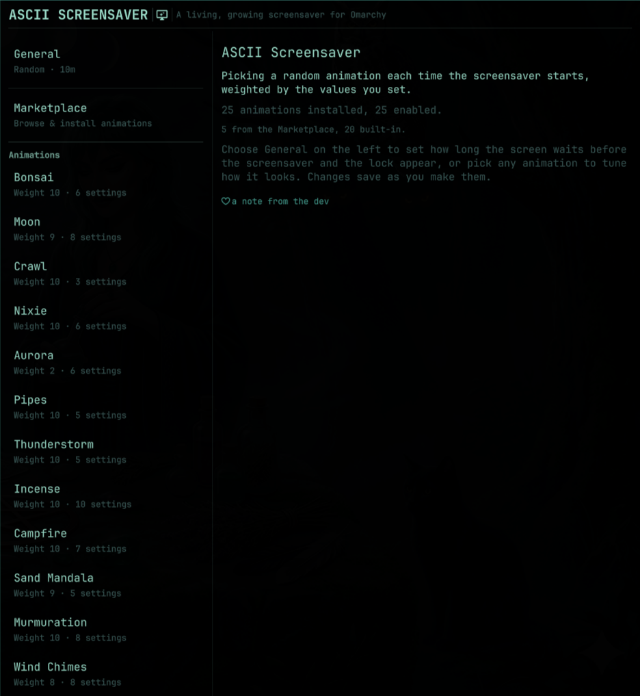

---

## Flagship Animations

All 30 built-in animations are enabled out of the box. These ten flagships are
weighted to come up most often:

| Animation | Preview | Description |
| --- | --- | --- |
| **aquarium** | 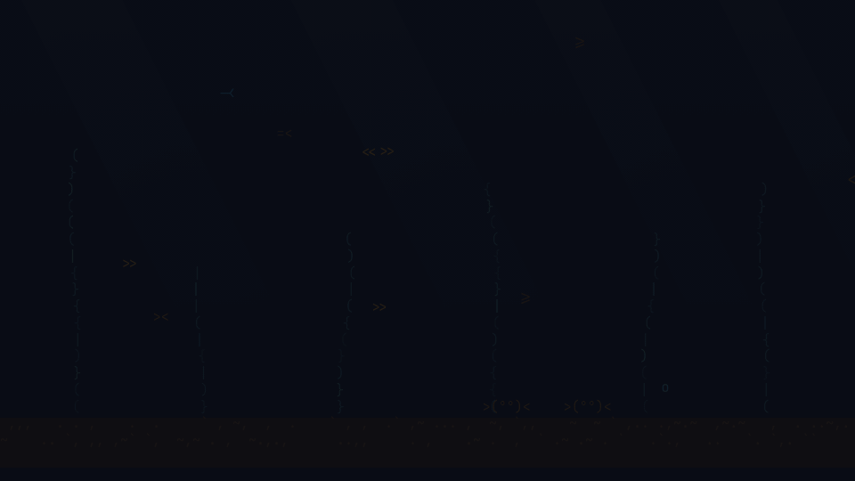 | A living reef: the fish school rests at night, flees a roaming predator and swarms feeding events, under a day/night cycle with sunbeams, bioluminescent plankton, kelp and sand crabs. |
| **aurora** | 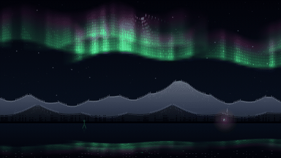 | A northern night: rayed curtains, green to crimson, cycle from quiet arcs through a substorm with a corona overhead, over snowy peaks and a frozen lake that mirrors them. A cabin smokes; a watcher stands on the shore. |
| **bonsai** | 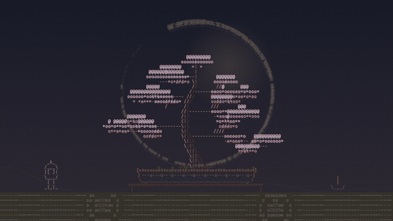 | A bonsai's life: an ensō is brushed on and a seed falls, then the tree grows year by year in one of six classic styles — blossom, full leaf, autumn colour, bare winter branches under snow — pruned each summer, until it returns to mist. |
| **incense** | 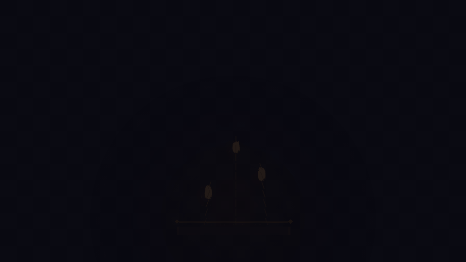 | An altar at night: incense smoke curls up before a seated figure and a breathing lotus mandala; candles flicker, sticks burn down and are relit, a singing bowl sounds, petals fall. |
| **nixie** | 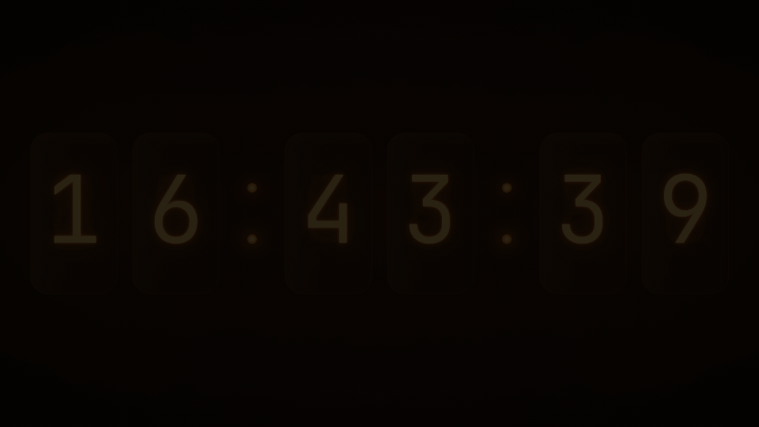 | A vintage nixie-tube clock with cathode-poisoning cycles, neon glow bloom and per-tube flicker. |
| **pendulum_wave** | 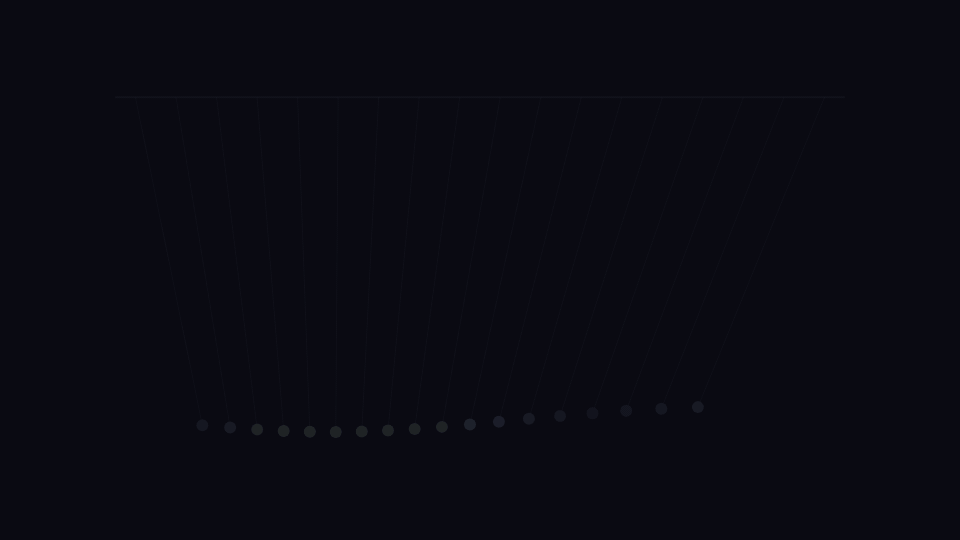 | Pendulums of progressively shorter period drift in and out of phase — travelling waves that periodically snap back into perfect sync. |
| **pipes** | 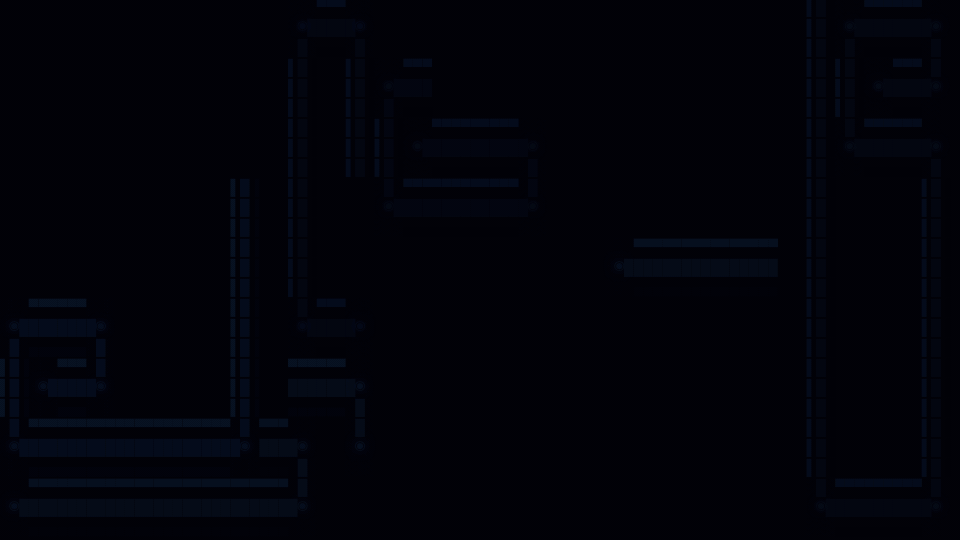 | Glossy 3D pipes grow through a lattice, shaded like lit metal and drawn in ASCII by brightness, then dissolve and rebuild from a new angle. |
| **sandmandala** | 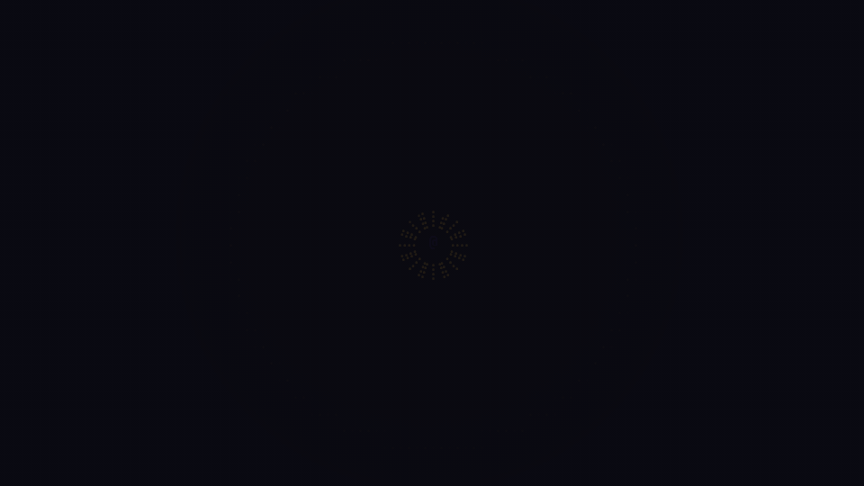 | A radial-symmetry sand mandala laid grain by grain, held, then swept away and rebuilt with a new pattern. |
| **terrarium** | 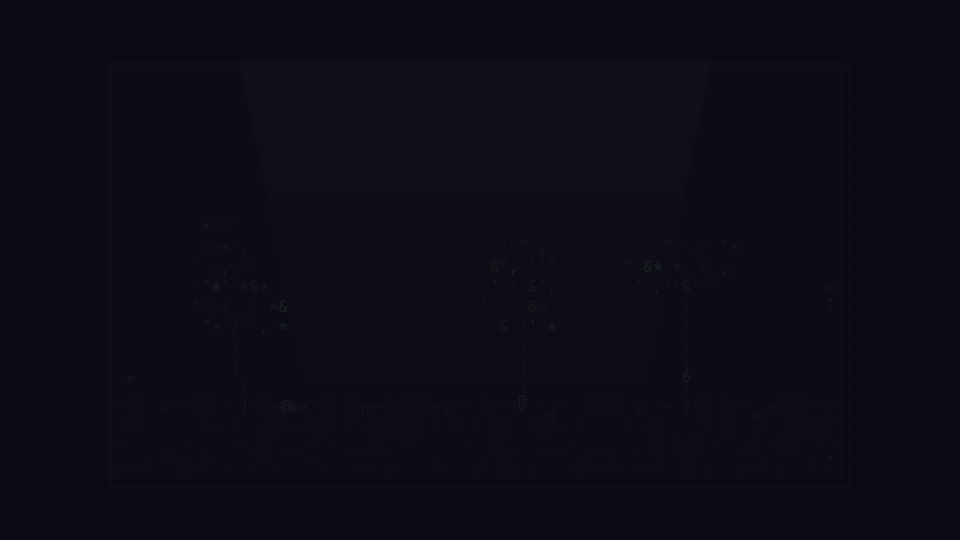 | A closed glass ecosystem: plants grow, seed and decay, fungi recycle the litter, and a small food web and an ant colony cycle through it under days and seasons. |
| **thunderstorm** | 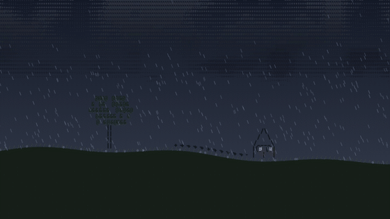 | A storm with a life: it gathers, breaks, peaks and clears to a rainbow, with branching bolts and gusting rain. Each palette is its own place — plains, tropical coast, desert or arctic. |

The other 20 — including **murmuration** (boids), **moon**, **campfire**,
**waterfall** and **spider web** — play less often; raise any animation's
weight, or turn it off, in the settings panel. The Marketplace adds more:
**dna**, **fireworks**, **galaxy**, **matrix**, **ocean** and whatever the
community builds next.

---

## Installation

This is an Omarchy plugin (requires Omarchy Quattro or later):

```bash
omarchy plugin add https://github.com/Evol-Luci/ascii_screensaver_plugin_omarchy.git --enable
```

This clones the plugin into
`~/.config/omarchy/plugins/io.github.evol-luci.ascii-screensaver/` and enables
it immediately; it takes over from Omarchy's built-in screensaver right away.

It needs `chromium`, `jq` and `socat` on the system (see
[THIRD_PARTY_NOTICES.md](THIRD_PARTY_NOTICES.md)). Coming from the old AUR
package or `install.sh`? See [MIGRATION.md](MIGRATION.md).

### Removal

```bash
omarchy plugin remove io.github.evol-luci.ascii-screensaver
```

Removing the plugin restores Omarchy's default idle service. Your settings
(`~/.config/ascii-screensaver/screensaver-config.json`) and any Marketplace
animations (`~/.config/omarchy/ascii-screensaver/animations/`) are left in
place in case you reinstall.

---

## The Settings Panel

Open it from the bar icon (󱄄), or from a terminal:

```bash
omarchy-shell shell summon io.github.evol-luci.ascii-screensaver '{}'
```

(`'{"select":"bonsai"}'` opens straight to one animation, `'{"select":"general"}'`
to the General page.)

**Animation pages.** Every animation has its own page with a **live preview**
at the top that updates as you change its settings — palettes, speeds, styles
and so on. **Full Screen Preview** plays it exactly as the screensaver would.
Each animation can be enabled or disabled, given a random-pick weight, or
uninstalled (built-ins can be reinstalled from the Marketplace).

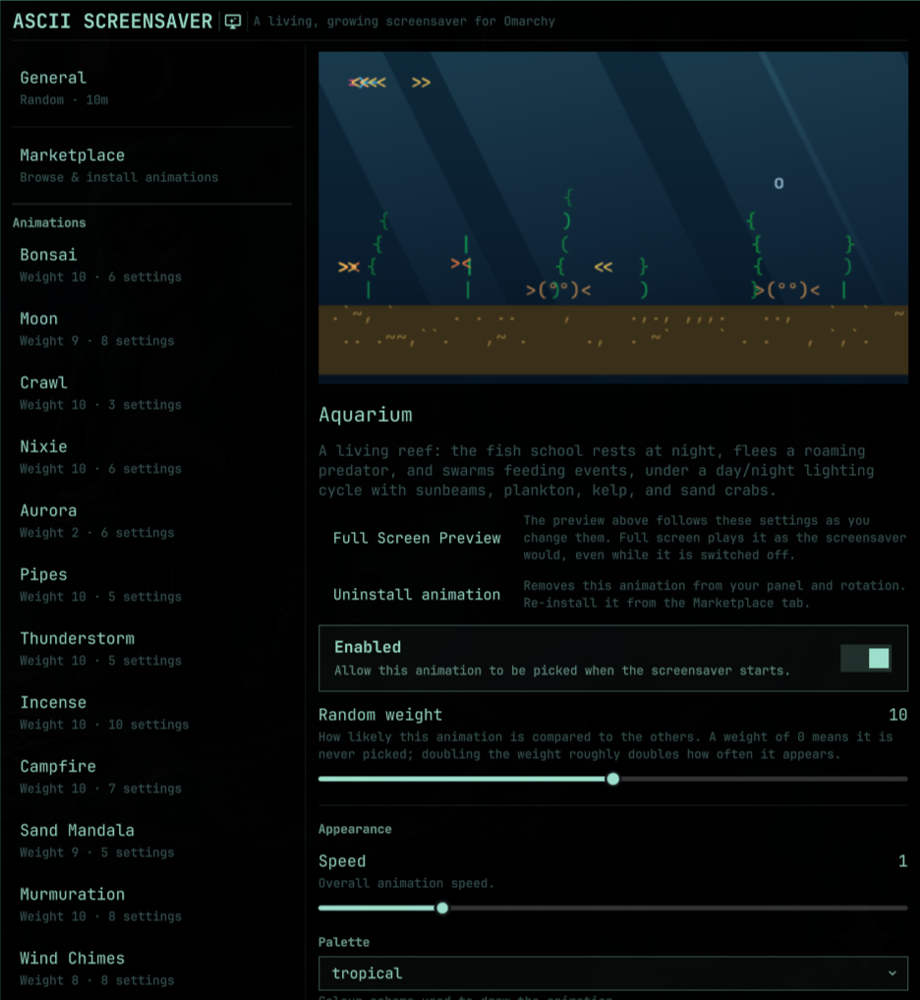

**General.** Turn the screensaver on or off, choose **random** (weighted) or
**single** mode, and set how long the machine idles before the screensaver
starts and before it locks.

**Stay awake while playing.** By default the screensaver and lock wait while a
video is playing (YouTube in a browser, mpv, VLC…) and start counting again
when it stops. Music playing in the background still lets the screensaver
start. Set it to **all** to wait for music too, or **off**.

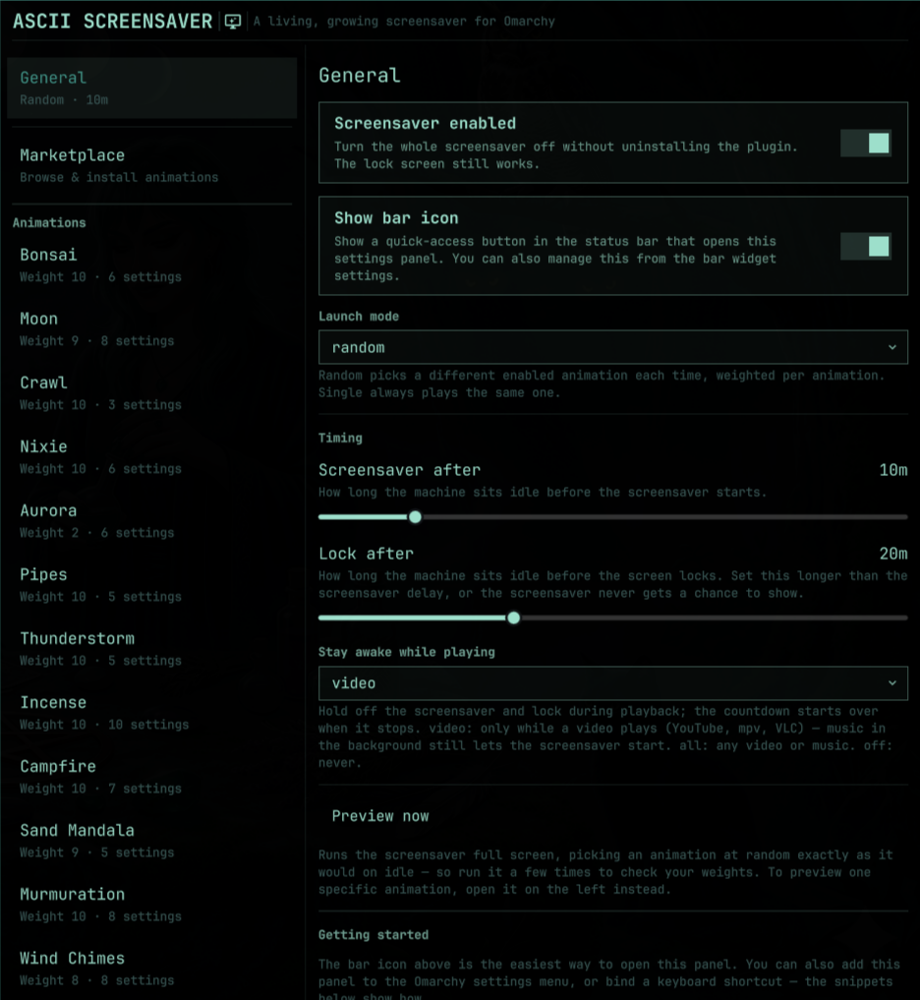

---

## The Marketplace

1. Open the settings panel and choose **Marketplace** in the sidebar.
2. Browse or search, and click **Install** on anything you like.

It's downloaded and added to your rotation straight away.

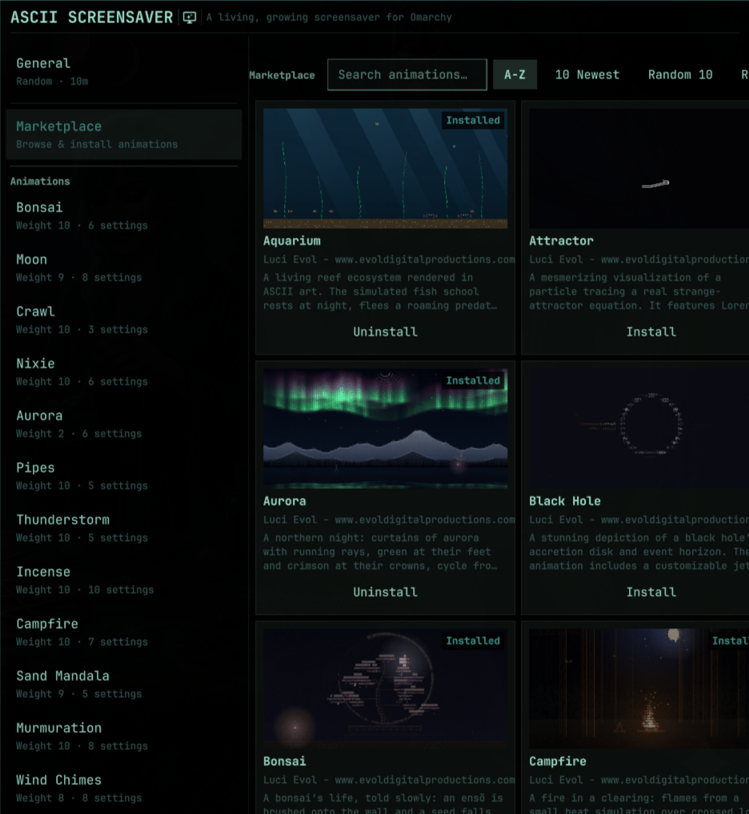

---

## Building Your Own Animation

An animation is a folder with three files:

```
my-animation/
├── index.html      # the animation (required)
├── manifest.json   # name, description, author, settings (required)
└── preview.gif     # preview for the Marketplace (.gif/.png/.jpg)
```

### You don't need to know how to code

Point an AI assistant at this README and the animations repo's
[CONTRIBUTING.md](https://github.com/Evol-Luci/ascii-screensaver-animations/blob/main/CONTRIBUTING.md):

> "I want to build an animation for the Omarchy ASCII Screensaver. Read the
> 'Building Your Own Animation' section of its README and its CONTRIBUTING.md,
> then write the complete `index.html` and `manifest.json` for [YOUR IDEA]."

### What the plugin does for you

Don't write any of this yourself — the plugin wraps every animation in its own
viewer, which:

- shows the **info panel** (your manifest's `name`, `description` and
  `author`) when the screensaver starts;
- **dismisses** the screensaver on mouse or keyboard input and hides the cursor;
- passes your settings in, and keeps multiple monitors in sync.

Your animation just draws.

### Rules

- **Self-contained.** Inline all JS and CSS. No scripts, images, stylesheets or
  frames from other hosts (a Google Fonts `@import` is the one exception), and
  no `fetch`, `XMLHttpRequest`, WebSocket, workers or `file:` URLs. The
  animation runs in a sandboxed frame with no network and no file access
  anyway, so these simply wouldn't work.
- **Handle resizing.** The screensaver can start before its window has its
  final size. Size your canvas in a `resize` handler, not just once at startup,
  or it will stay blank.
- **Under 2 MB** for the whole folder, preview included.

### Reading your settings

Settings arrive as URL query parameters. Read them at the top of your script,
falling back to your defaults:

```js
const params  = new URLSearchParams(location.search);
const speed   = parseFloat(params.get('speed') || '1');
const palette = params.get('palette') || 'terminal';
```

### `manifest.json`

The `id` must match the folder name. Each entry in `params` becomes a control
on the animation's settings page.

```json
{
  "id": "my-anim",
  "name": "My Cool Animation",
  "description": "A short, plain-text description of what this does.",
  "author": "Your Name",
  "version": "1.0.0",
  "preview": "preview.gif",
  "params": [
    { "key": "speed", "type": "range", "label": "Speed",
      "defaultValue": 1, "min": 0.1, "max": 5, "step": 0.1 },
    { "key": "palette", "type": "select", "label": "Palette",
      "defaultValue": "terminal", "options": ["terminal", "amber", "vaporwave"] },
    { "key": "stars", "type": "select", "label": "Stars",
      "defaultValue": 1, "options": [0, 1] }
  ]
}
```

A `select` with numeric options `[0, 1]` shows as an on/off switch. The full
rules (text limits, reserved setting names) are in CONTRIBUTING.md.

### Trying it locally

1. Put your folder in `~/.config/omarchy/ascii-screensaver/animations/`
   (create the directory if needed).
2. Open the settings panel — your animation appears in the sidebar, with its
   live preview and settings.

### Ideas

- **Generative art** — fractals, recursive geometry, mathematical visualizers
- **Retro tech** — CRT glitches, telemetry readouts, old boot sequences
- **Nature and living systems** — weather, growth, flocking, ecosystems
- **Cyberpunk and data** — network graphs, hacker interfaces
- **Optical illusions** — perspective tricks, infinite tunnels, moiré

---

## Submitting to the Marketplace

1. Make a `preview.gif` (or `.png`/`.jpg`) of your animation in action.
2. Fork [ascii-screensaver-animations](https://github.com/Evol-Luci/ascii-screensaver-animations).
3. Add your folder under `animations/`.
4. Open a pull request. A bot validates it, renders it live in a real browser
   and posts the result next to your preview; a maintainer reviews and merges.

---

## Coming Features

Planned next — details in [docs/TODO.md](docs/TODO.md):

- **Now playing over the screensaver.** When music is playing and the
  screensaver starts, a small card shows the track, artist, album art and
  progress.
- **Media keys that don't wake the screen.** Play/pause, next, previous and
  stop control the music without dismissing the screensaver.

---

## License

GPL-3.0 — see [LICENSE](LICENSE).
